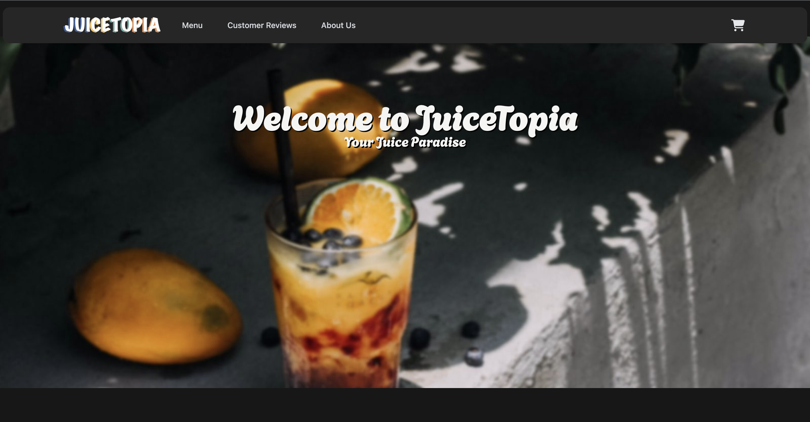
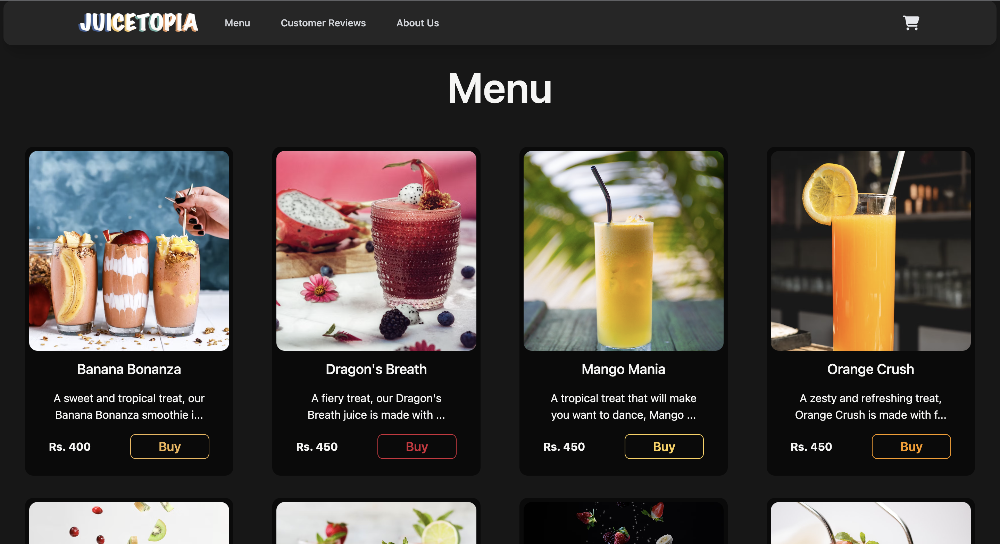

# [JuiceTopia: A Sri Lankan Juice Odyssey](https://juice-topia.vercel.app/)

## Website link: [JuiceTopia](https://juice-topia.vercel.app/)

## Setting up the project

### Software requirements

> - Install Node.js from [here](https://nodejs.org/en/download) (Node.js version should be newer than 18.17.1 and npm version should be newer than 9.6.7) **(required)**
> - Install git from [here](https://git-scm.com/downloads) (git is needed to clone the repository)

## Setup instructions

1. Open the terminal
2. Run `git clone https://github.com/Rashaad1268/JuiceTopia.git` to clone this repository (if you have not already downloaded the source code)
3. Run `cd JuiceTopia/website`
4. Run `npm install` (this will take some time)
5. After that run `npm run dev`
6. Open the url `http://localhost:4321/` in your browser

## About the team

### Team name: The Rectifiers

### Team Members

- Aditha Geeganage
- Thavindu Muthumala
- Shazan Shafee
- Dasindu Suwahas
- Z. M. Akbar Rashaad

## Citations

- The [Astro](https://astro.build/) JavaScript framework is used to make the website

- Icons are taken from [Font Awesome](https://fontawesome.com/)

- Images are taken from [Unsplash](https://unsplash.com/)
